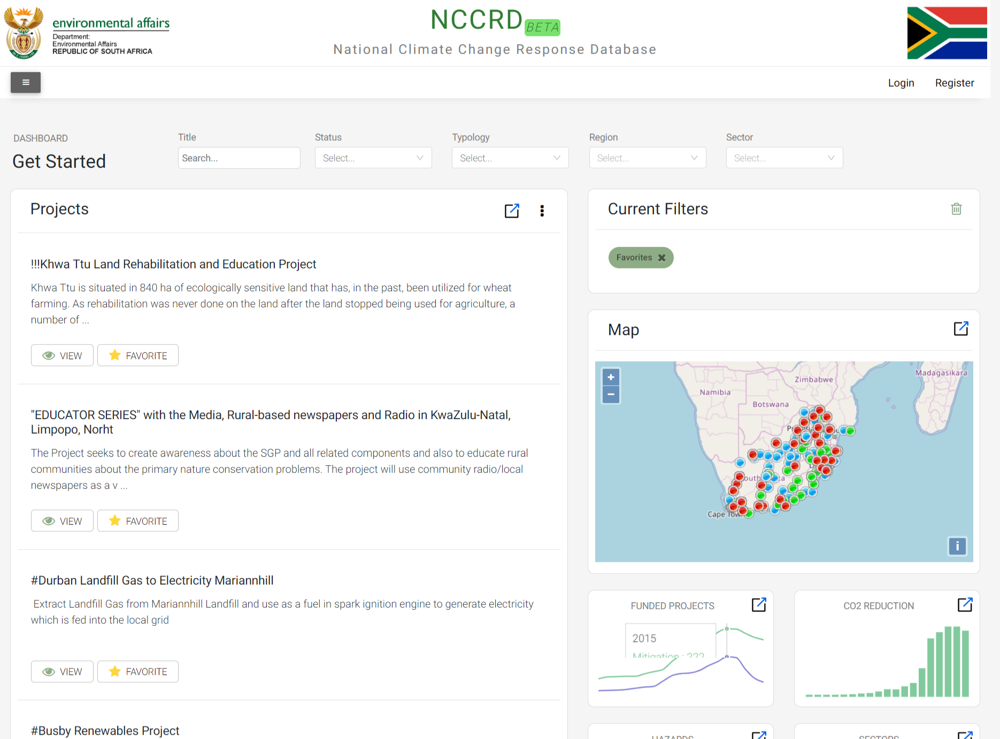
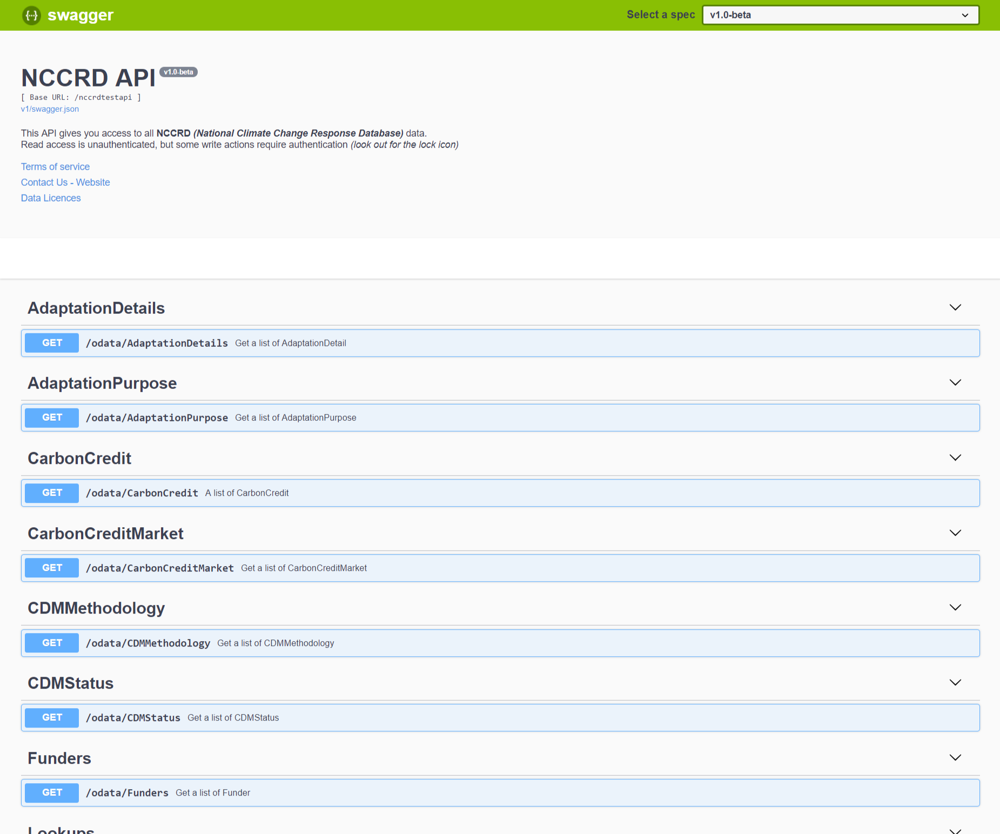

### NCCRD
National Climate Change Response Database

This is the home of the NCCRD, an app that forms part of the [National Climate Change Information System (NCCIS)](https://github.com/saeondata.nccis). 

To get a copy of this on your machine, please follow the instructions outlined in the [docs](https://saeondata.github.io/nccis-docs/docs/doc1.html) under the `Client` section. 

#### Licensing
The NCCRD isf ree to share, adapt, and apply the work, even for commercial purposes, provided that you give appropriate credit and distribute the adaptations under the same license.

http://creativecommons.org/licenses/by-sa/4.0/

<!-- Dashboard:

API (Swagger Docs):
 -->

